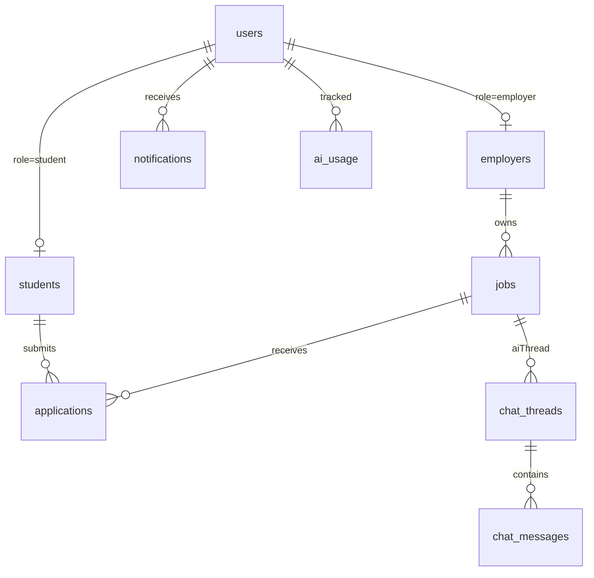

# LanTURN — Firestore Database Schema

> NoSQL document model. Document id shown in `{braces}`. Field types use Firestore terminology.
> **Rule:** Files live in Firebase Storage; only **URLs** are stored in Firestore.

---

## 1. Collections Overview



| Collection | Purpose |
|-----------|---------|
| `users` | Base identity + role + flags for every authenticated person. |
| `students` | Student-specific profile (1:1 with `users` where role=student). |
| `employers` | Employer/company profile (1:1 with `users` where role=employer). |
| `jobs` | Job postings. |
| `applications` | A student applying to a job. |
| `notifications` | In-app notifications. |
| `chat_threads` | AI career-assistant conversation threads. |
| `chat_messages` | Messages inside a thread. |
| `ai_usage` | Per-user AI quota/token ledger. |
| `analytics_events` | Append-only events for admin dashboards. |
| `platform_config` | Singleton-ish admin-managed settings. |

> **Design choice — base `users` + role subcollection:** Keeps auth/identity concerns in one place and role-specific data isolated. Alternative (single `profiles` collection with optional fields) is acceptable; we choose role subcollections for clarity.

---

## 2. `users/{uid}`

Base document keyed by Firebase Auth `uid`.

| Field | Type | Required | Notes |
|-------|------|----------|-------|
| `uid` | string | ✅ | == document id; Firebase Auth UID. |
| `email` | string | ✅ | From Google. Lowercased. |
| `emailVerified` | boolean | ✅ | From Auth. |
| `displayName` | string | ⛔ | From Google (display only). |
| `photoURL` | string | ⛔ | Google photo URL (display only). |
| `authProvider` | string | ✅ | e.g. `"google.com"`. |
| `role` | enum \| null | ✅ | `student` \| `employer` \| `admin` \| `null` (until onboarding). |
| `profileComplete` | boolean | ✅ | `false` until onboarding done. |
| `status` | enum | ✅ | `active` \| `disabled`. |
| `createdAt` | timestamp | ✅ | serverTimestamp. |
| `updatedAt` | timestamp | ✅ | serverTimestamp on write. |
| `lastLoginAt` | timestamp | ⛔ | Updated on session handshake. |

**Indexes:** `email` (unique via Auth), `role` + `status` (admin list).

---

## 3. `students/{uid}`

1:1 with `users` where `role == student`. Document id == `uid`.

| Field | Type | Required | Notes |
|-------|------|----------|-------|
| `uid` | string | ✅ | FK → `users/{uid}`. |
| `personal` | map | ✅ | `{ name, phone, city, state, country }`. |
| `academic` | map | ✅ | `{ college, degree, branch, graduationYear, cgpa }`. |
| `professional` | map | ✅ | `{ skills: string[], resumeUrl, projects: [], experience: [], certifications: [] }`. |
| `social` | map | ⛔ | `{ github, linkedin, portfolio }`. |
| `profilePhotoURL` | string | ⛔ | Storage URL. |
| `resumeUrl` | string | ⛔ | Storage URL (PDF). |
| `resumeText` | string | ⛔ | Extracted text cache for AI (avoid re-parsing). |
| `searchableSkills` | string[] | ✅ | Lowercased skills for array-contains queries. |
| `graduationYear` | number | ✅ | Denormalized for filtering. |
| `createdAt` / `updatedAt` | timestamp | ✅ | |

**Substructure examples**

```jsonc
// professional.projects[]
{
  "title": "string",
  "description": "string",
  "link": "string",
  "techStack": ["string"]
}

// professional.experience[]
{
  "company": "string",
  "role": "string",
  "startDate": "string",   // ISO month
  "endDate": "string",     // ISO month or null
  "description": "string"
}

// professional.certifications[]
{
  "name": "string",
  "issuer": "string",
  "date": "string",
  "url": "string"
}
```

**Indexes:**
- `graduationYear` (single field).
- `searchableSkills` array-contains (for admin/recruiter search).
- `academic.college` (single field).

---

## 4. `employers/{uid}`

1:1 with `users` where `role == employer`. Document id == `uid`.

| Field | Type | Required | Notes |
|-------|------|----------|-------|
| `uid` | string | ✅ | FK → `users/{uid}`. |
| `companyName` | string | ✅ | |
| `logoURL` | string | ⛔ | Storage URL. |
| `website` | string | ⛔ | |
| `description` | string | ⛔ | |
| `location` | map | ⛔ | `{ city, state, country }`. |
| `industry` | string | ⛔ | |
| `hrContact` | map | ✅ | `{ name, email, phone }`. |
| `verified` | boolean | ✅ | Admin-set; default `false`. |
| `createdAt` / `updatedAt` | timestamp | ✅ | |

**Indexes:** `industry`, `verified`.

---

## 5. `jobs/{jobId}`

| Field | Type | Required | Notes |
|-------|------|----------|-------|
| `jobId` | string | ✅ | == document id. |
| `employerId` | string | ✅ | FK → `employers/{uid}` (== users uid). |
| `companyName` | string | ✅ | Denormalized for list display. |
| `companyLogoURL` | string | ⛔ | Denormalized. |
| `title` | string | ✅ | |
| `description` | string | ✅ | |
| `requirements` | string[] | ✅ | Bullet list. |
| `requiredSkills` | string[] | ✅ | Lowercased, for matching/filter. |
| `location` | map | ✅ | `{ city, state, country, remote: boolean }`. |
| `jobType` | enum | ✅ | `full-time` \| `internship` \| `part-time` \| `contract`. |
| `industry` | string | ⛔ | |
| `salary` | map | ⛔ | `{ min, max, currency, period }`. |
| `experienceLevel` | enum | ⛔ | `entry` \| `junior` \| `mid` \| `senior`. |
| `openings` | number | ⛔ | default 1. |
| `deadline` | timestamp | ⛔ | |
| `status` | enum | ✅ | `draft` \| `active` \| `closed` \| `removed`. |
| `applicationCount` | number | ✅ | Denormalized counter. |
| `createdAt` / `updatedAt` | timestamp | ✅ | |

**Indexes (composite)**
- `status` ASC + `createdAt` DESC — default active feed.
- `status` ASC + `location.country` ASC + `createdAt` DESC.
- `status` ASC + `jobType` ASC + `createdAt` DESC.
- `status` ASC + `industry` ASC + `createdAt` DESC.
- `requiredSkills` array-contains (with `status` filter applied in app).
- `employerId` ASC + `createdAt` DESC — employer's own posts.

---

## 6. `applications/{applicationId}`

| Field | Type | Required | Notes |
|-------|------|----------|-------|
| `applicationId` | string | ✅ | == document id. |
| `jobId` | string | ✅ | FK → `jobs/{jobId}`. |
| `jobTitle` | string | ✅ | Denormalized. |
| `employerId` | string | ✅ | Denormalized for employer queries. |
| `studentId` | string | ✅ | FK → `students/{uid}` (== uid). |
| `studentName` | string | ✅ | Denormalized snapshot. |
| `studentPhotoURL` | string | ⛔ | Snapshot. |
| `resumeUrl` | string | ✅ | Snapshot of resume at apply time. |
| `resumeTextSnapshot` | string | ⛔ | Snapshot for employer-side AI matching. |
| `skillsSnapshot` | string[] | ⛔ | Denormalized for filtering applicants. |
| `coverLetter` | string | ⛔ | Optional. |
| `matchScore` | number | ⛔ | 0–100 from AI (cached). |
| `status` | enum | ✅ | `submitted` \| `reviewed` \| `shortlisted` \| `accepted` \| `rejected` \| `withdrawn`. |
| `statusHistory` | array | ⛔ | `[{ status, at, by }]`. |
| `createdAt` / `updatedAt` | timestamp | ✅ | |

**Indexes (composite)**
- `studentId` ASC + `createdAt` DESC — student's tracker.
- `jobId` ASC + `createdAt` DESC — employer's applicants list.
- `jobId` ASC + `status` ASC + `createdAt` DESC.
- **Uniqueness:** Enforce one active application per (studentId, jobId) via a composite unique constraint pattern (document id = `${studentId}_${jobId}`) — see §10.

---

## 7. `notifications/{notificationId}`

| Field | Type | Required | Notes |
|-------|------|----------|-------|
| `userId` | string | ✅ | Recipient's uid. |
| `type` | enum | ✅ | `application_received` \| `application_status` \| `system` \| `job_removed` … |
| `title` | string | ✅ | |
| `body` | string | ✅ | |
| `link` | string | ⛔ | Deep link path in app. |
| `data` | map | ⛔ | `{ jobId, applicationId, … }`. |
| `channel` | enum | ✅ | `inapp` \| `email` \| `both`. |
| `emailStatus` | enum | ⛔ | `pending` \| `sent` \| `failed` \| `skipped`. |
| `read` | boolean | ✅ | default `false`. |
| `createdAt` | timestamp | ✅ | |

**Indexes (composite)**
- `userId` ASC + `createdAt` DESC — inbox.
- `userId` ASC + `read` ASC + `createdAt` DESC — unread first.

---

## 8. `chat_threads/{threadId}` and `chat_messages/{messageId}`

### `chat_threads/{threadId}`

| Field | Type | Required | Notes |
|-------|------|----------|-------|
| `threadId` | string | ✅ | == doc id. |
| `userId` | string | ✅ | Owner (student). |
| `title` | string | ⛔ | Auto/from first message. |
| `mode` | enum | ✅ | `career_guidance` \| `interview_prep` \| `general`. |
| `context` | map | ⛔ | `{ jobId?, resumeUrl? }`. |
| `createdAt` / `updatedAt` | timestamp | ✅ | |
| `lastMessagePreview` | string | ⛔ | |
| `lastMessageAt` | timestamp | ⛔ | |

**Indexes:** `userId` ASC + `updatedAt` DESC.

### `chat_messages/{messageId}`

| Field | Type | Required | Notes |
|-------|------|----------|-------|
| `threadId` | string | ✅ | FK → `chat_threads`. |
| `role` | enum | ✅ | `user` \| `assistant`. |
| `content` | string | ✅ | |
| `tokensUsed` | number | ⛔ | |
| `createdAt` | timestamp | ✅ | |

**Indexes:** `threadId` ASC + `createdAt` ASC.

---

## 9. `ai_usage/{uid}` and `analytics_events`

### `ai_usage/{uid}` (per-user daily/rolling quota ledger)

| Field | Type | Notes |
|-------|------|------|
| `uid` | string | == doc id. |
| `periodKey` | string | e.g. `"2026-07-28"` or rolling window id. |
| `requestCount` | number | |
| `tokensUsed` | number | |
| `lastRequestAt` | timestamp | |
| `updatedAt` | timestamp | |

> Used to enforce per-user rate limits so a few users cannot exhaust the Gemini free quota.

### `analytics_events/{eventId}` (append-only)

| Field | Type | Notes |
|-------|------|------|
| `type` | string | e.g. `job_posted`, `application_submitted`, `user_signup`. |
| `actorId` | string | |
| `role` | string | |
| `metadata` | map | event-specific. |
| `createdAt` | timestamp | |

**Indexes:** `type` ASC + `createdAt` DESC; `createdAt` DESC.

---

## 10. Relationship & Uniqueness Patterns

- **1:1 user↔profile:** document id in `students`/`employers` equals `uid`.
- **Unique application per (student, job):** Use id `${studentId}_${jobId}` and rely on "create if not exists" semantics. Re-applying to an active application returns the existing one (or an error). Withdrawing frees the slot.
- **Denormalization policy:** Copy display fields (`companyName`, `studentName`, `jobTitle`) into child documents to avoid fan-out reads. Update via a single service method when the parent changes.

---

## 11. Counters & Aggregates

- `jobs.applicationCount`: maintained by the application service on create/withdraw.
- `employers.jobCount` (optional): maintained on job create/close.
- Admin dashboards read from `analytics_events` aggregations rather than live `count()` queries (Firestore `count()` is fine for moderate scale; otherwise pre-aggregate).

---

## 12. Index Recommendations Summary

| Collection | Fields | Type |
|-----------|--------|------|
| users | role, status | composite |
| students | graduationYear | single |
| students | searchableSkills | array-contains |
| employers | industry, verified | composite |
| jobs | status, createdAt | composite |
| jobs | status, location.country, createdAt | composite |
| jobs | status, jobType, createdAt | composite |
| jobs | status, industry, createdAt | composite |
| jobs | requiredSkills | array-contains |
| jobs | employerId, createdAt | composite |
| applications | studentId, createdAt | composite |
| applications | jobId, createdAt | composite |
| applications | jobId, status, createdAt | composite |
| notifications | userId, createdAt | composite |
| notifications | userId, read, createdAt | composite |
| chat_threads | userId, updatedAt | composite |
| chat_messages | threadId, createdAt | composite |
| analytics_events | type, createdAt | composite |

---

## 13. Data Sizing & Free-Tier Notes

- Firestore free tier (Spark): 50K reads / 20K writes / 1 GiB storage per day. Sufficient for v1; monitor.
- Prefer **single-field denormalization** over multi-collection joins to reduce read amplification.
- Avoid `CollectionGroup` scans on large collections without indexes.
- TTL/cleanup jobs (out of v1) can prune old `notifications` and `chat_messages`.

---

## 14. Sample Document (student)

```jsonc
{
  "uid": "abc123google",
  "personal": { "name": "Asha Rao", "phone": "+91…", "city": "Bengaluru", "state": "Karnataka", "country": "India" },
  "academic": { "college": "XYZ Institute", "degree": "B.E.", "branch": "CSE", "graduationYear": 2026, "cgpa": 8.7 },
  "professional": {
    "skills": ["react", "node", "firebase"],
    "resumeUrl": "https://firebasestorage…/resumes/abc123.pdf",
    "projects": [],
    "experience": [],
    "certifications": []
  },
  "social": { "github": "asha", "linkedin": "asha-rao", "portfolio": "" },
  "searchableSkills": ["react", "node", "firebase"],
  "graduationYear": 2026,
  "profilePhotoURL": "https://firebasestorage…/photos/abc123.jpg",
  "resumeUrl": "https://firebasestorage…/resumes/abc123.pdf",
  "createdAt": "2026-07-28T10:00:00Z",
  "updatedAt": "2026-07-28T10:05:00Z"
}
```
