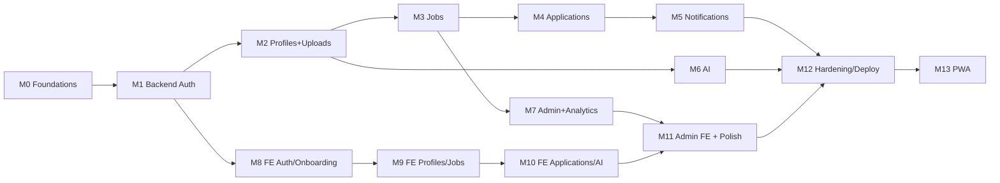

# LanTURN — Development Roadmap

> Milestones are ordered: **backend before frontend**, foundations before features.
> Each milestone lists objectives, deliverables, dependencies, a completion checklist, and recommended Git commits (Conventional Commits).

---

## Milestone 0 — Foundations & Repo Setup

**Objectives**
- Stand up monorepo, tooling, Firebase project(s), CI skeleton.

**Deliverables**
- `frontend/` + `backend/` workspaces with package.json.
- ESLint + Prettier + editorconfig.
- GitHub repo + branch protection (main).
- Firebase dev project: Auth (Google), Firestore, Storage enabled.
- `.env.example` files; `.gitignore` for secrets.
- CI: lint + tests on PRs.

**Dependencies:** None.

**Completion checklist**
- [ ] Repo initialized; folders per `BACKEND_STRUCTURE.md` / `FRONTEND_STRUCTURE.md`.
- [ ] `npm install && npm run dev` works for both apps.
- [ ] Firebase dev project configured; emulators run locally.
- [ ] CI green on a sample PR.

**Recommended commits**
- `chore: scaffold monorepo (frontend + backend)`
- `chore: configure eslint, prettier, editorconfig`
- `chore(ci): add lint + test workflow`
- `chore(firebase): create dev project config + emulator setup`

---

## Milestone 1 — Backend Skeleton & Auth

**Objectives**
- Express app with layered structure, config, middlewares, Firebase Admin, health endpoints, and Google auth.

**Deliverables**
- `app.js`, `server.js`, `config/`, `firebase/`, all middlewares (auth, rbac, validate, rateLimit, error, notFound).
- Standard error envelope + `AppError`.
- `users/{uid}` provisioning on first login (transaction).
- Endpoints: `/api/health`, `/api/health/ready`, `/api/auth/session`, `/api/auth/onboarding`, `/api/auth/logout`.
- zod schemas for auth/onboarding.

**Dependencies:** M0.

**Completion checklist**
- [ ] `GET /api/health` returns 200; `/ready` checks Firebase.
- [ ] Google login → `POST /api/auth/session` returns role/profileComplete.
- [ ] Onboarding writes `users` + role subcollection.
- [ ] Auth/RBAC/validate/error middlewares unit-tested.
- [ ] Postman/bruno collection started.

**Recommended commits**
- `feat(api): bootstrap express app with layered structure`
- `feat(api): add firebase admin + config validation`
- `feat(api): implement auth middleware and /auth/session`
- `feat(api): implement onboarding flow with role selection`
- `test(api): cover auth and onboarding flows`

---

## Milestone 2 — Profiles & File Uploads

**Objectives**
- Student/employer profile CRUD + resume/photo/logo uploads.

**Deliverables**
- `students`, `employers` repositories + services + controllers + routes.
- zod schemas for profiles.
- `/api/uploads/sign` + `/api/uploads/commit` with MIME/size validation.
- Storage path layout + signed URLs.
- Resume text extraction + caching (`resumeText`).

**Dependencies:** M1.

**Completion checklist**
- [ ] Student can GET/PUT/PATCH own profile.
- [ ] Employer can GET/PUT/PATCH own company profile.
- [ ] Upload sign → PUT → commit flow works for resume/photo/logo.
- [ ] Invalid MIME/size rejected with 400/413/415.
- [ ] Ownership enforced; cross-user access returns 404.

**Recommended commits**
- `feat(api): student profile CRUD`
- `feat(api): employer company profile CRUD`
- `feat(api): file upload sign+commit with validation`
- `feat(api): cache extracted resume text`

---

## Milestone 3 — Jobs

**Objectives**
- Full job lifecycle: create, edit, delete, browse, search, filter.

**Deliverables**
- `jobs` repository + service + controller + routes + schema.
- Search/filter with composite indexes.
- Employer's own-jobs list.
- Soft delete (`status=removed`).
- Admin job moderation hook.

**Dependencies:** M2 (employer profile must exist to post).

**Completion checklist**
- [ ] Employer can create/edit/delete only own jobs.
- [ ] Public/auth list supports `q`, `jobType`, `industry`, `country`, `remote`, `skill`, pagination.
- [ ] Composite indexes deployed and queries use them.
- [ ] Counter `applicationCount` initializes to 0.

**Recommended commits**
- `feat(api): job create/update/delete for employers`
- `feat(api): job browse/search/filter with pagination`
- `feat(api): employer 'my jobs' listing`
- `chore(firestore): deploy jobs composite indexes`

---

## Milestone 4 — Applications

**Objectives**
- Apply, track, view applicants, accept/reject, withdraw.

**Deliverables**
- `applications` repository + service + controller + routes + schema.
- Unique active application per (student, job).
- Snapshot of resume/skills at apply time.
- Status transitions + `statusHistory`.
- Counter updates in a transaction.

**Dependencies:** M3.

**Completion checklist**
- [ ] Student can apply once per active job; duplicate → 409.
- [ ] Deadline passed / inactive job → 422.
- [ ] Employer sees applicants only for own jobs.
- [ ] Status changes update `statusHistory`.
- [ ] Withdraw frees the application slot.

**Recommended commits**
- `feat(api): apply to job with uniqueness + snapshot`
- `feat(api): application status transitions + history`
- `feat(api): employer applicants listing`
- `feat(api): student application tracker + withdraw`

---

## Milestone 5 — Notifications

**Objectives**
- In-app + email notifications on key events.

**Deliverables**
- `notifications` repository + `notification.service` + email templates + provider client.
- Event hooks in `application.service` (received/status) and admin moderation (job_removed).
- Endpoints: list, mark read, read-all, unread-count.
- Email retries + status updates.

**Dependencies:** M4.

**Completion checklist**
- [ ] Apply → employer notified (in-app + email).
- [ ] Status change → student notified (in-app + email).
- [ ] Idempotent per event key.
- [ ] Email failures recorded; primary request unaffected.

**Recommended commits**
- `feat(api): notification service + model`
- `feat(api): email client + templates`
- `feat(api): wire notifications to application events`
- `feat(api): notification list/read/unread endpoints`

---

## Milestone 6 — AI (Gemini)

**Objectives**
- Server-side Gemini features + per-user quotas.

**Deliverables**
- `gemini.client`, `ai.service`, `aiQuota.service`, repositories for `chat_threads/messages`, `ai_usage`.
- Endpoints: resume-review, resume-match, skill-gap, interview-questions, cover-letter, career-chat (+ thread listing).
- zod validation on all AI outputs; prompt injection defenses.

**Dependencies:** M2 (resume), M3 (jobs).

**Completion checklist**
- [ ] Resume review returns validated JSON with score + suggestions.
- [ ] Match returns matchScore + matched/missing skills.
- [ ] Chat persists messages + tokens; enforces ownership.
- [ ] Quota returns 429 after daily limit.
- [ ] Secrets never leave the server.

**Recommended commits**
- `feat(ai): gemini client with safety/retry/timeout`
- `feat(ai): resume review + match endpoints`
- `feat(ai): skill-gap, interview questions, cover letter`
- `feat(ai): career chat with threads + quota`

---

## Milestone 7 — Admin & Analytics

**Objectives**
- Moderation + analytics + platform config.

**Deliverables**
- `admin.service`, `analytics.service`, endpoints per `API_SPECIFICATION.md §9`.
- `analytics_events` writes on key actions.
- Admin role bootstrap (manual/cloud console).

**Dependencies:** M3, M4.

**Completion checklist**
- [ ] Admin can list/search users, disable users, change role within policy.
- [ ] Admin can moderate (remove) jobs.
- [ ] Analytics summary + series endpoints return data.
- [ ] Platform config read/update works.

**Recommended commits**
- `feat(admin): user moderation endpoints`
- `feat(admin): job moderation endpoints`
- `feat(admin): analytics summary + series`
- `feat(admin): platform config management`

---

## Milestone 8 — Frontend: Auth, Onboarding, Layout

**Objectives**
- Web shell: routing, auth context, onboarding, role-based layouts.

**Deliverables**
- Vite + React + Tailwind + TanStack Query + react-router + firebase client.
- `apiClient` with auth interceptor + error envelope.
- Login, onboarding (role select + student/employer forms), app shell, route guards.
- Notification bell scaffold.

**Dependencies:** M1 (auth API).

**Completion checklist**
- [ ] Google login works; token attached to requests.
- [ ] Onboarding routes write to backend.
- [ ] Guards redirect correctly (auth/role/profileComplete).
- [ ] 401 handling refreshes or signs out.

**Recommended commits**
- `feat(web): scaffold app, router, layout, api client`
- `feat(web): google login + auth context`
- `feat(web): onboarding flows for student and employer`

---

## Milestone 9 — Frontend: Profiles, Uploads, Jobs

**Objectives**
- Profile editing, upload UX, browse/search/filter jobs, job detail.

**Deliverables**
- Student & employer profile pages with forms + uploaders.
- Jobs browse with filters/search + job detail + apply.
- Employer: my jobs, create/edit job form.

**Dependencies:** M2, M3, M8.

**Completion commits**
- `feat(web): student profile page with resume/photo upload`
- `feat(web): employer profile page with logo upload`
- `feat(web): jobs browse/search/filter + detail`
- `feat(web): employer job management UI`

---

## Milestone 10 — Frontend: Applications, Notifications, AI

**Objectives**
- Application tracker, employer applicant review, real-time notifications, AI assistant UI.

**Deliverables**
- Student application tracker; employer applicants list + status actions.
- Real-time notification bell + toast + notifications page.
- AI assistant chat + resume review + match panels.

**Dependencies:** M4, M5, M6, M9.

**Completion commits**
- `feat(web): student application tracker`
- `feat(web): employer applicants review UI`
- `feat(web): real-time notifications + bell`
- `feat(web): AI assistant + resume review UI`

---

## Milestone 11 — Admin Frontend & Polish

**Objectives**
- Admin dashboard, analytics, moderation UI; accessibility & responsive pass.

**Deliverables**
- Admin pages (users, jobs, analytics, config).
- Responsive + a11y review (WCAG 2.1 AA where feasible).
- Empty/loading/error states across the app.

**Dependencies:** M7, M10.

**Completion commits**
- `feat(web): admin dashboard + moderation`
- `feat(web): admin analytics views`
- `style(web): responsive + accessibility polish`

---

## Milestone 12 — Hardening & Deploy

**Objectives**
- Production readiness: security, observability, deploy pipelines.

**Deliverables**
- Deploy frontend to Vercel, backend to Render/Oracle.
- Prod Firebase project with strict rules + indexes.
- Security checklist (`SECURITY.md §12`) fully met.
- Monitoring/logging review; secret rotation process.
- Smoke tests for end-to-end flows.

**Dependencies:** All prior.

**Completion commits**
- `chore(deploy): vercel + render configuration`
- `chore(firebase): prod project rules + indexes`
- `chore(security): finalize rate limits, helmet, cors`
- `docs: deployment + runbook`

---

## Milestone 13 — PWA & Mobile-Ready (post-launch)

**Objectives**
- Installable PWA, offline shell, web push.

**Deliverables** (per `MOBILE_PLAN.md`)
- `vite-plugin-pwa`, manifest, icons, offline shell, FCM web push, `POST /api/devices/register`.

**Dependencies:** M12.

**Completion commits**
- `feat(web): PWA manifest + service worker + offline shell`
- `feat(api): device token registration + FCM dispatch`
- `feat(web): web push notifications`

---

## Sequencing Summary

---

## Definition of Done (project-level)
- All v1 functional requirements met (`REQUIREMENTS.md §1`).
- `SECURITY.md §12` checklist complete.
- End-to-end: signup → profile → post job → apply → accept/reject → notification.
- Deployed to prod with monitoring and a runbook.
