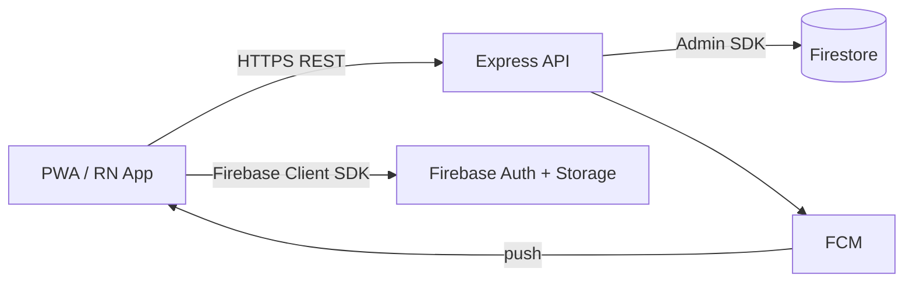

# LanTURN — Mobile Plan

> Companion to `SYSTEM_ARCHITECTURE.md` and `API_SPECIFICATION.md`.

---

## 1. Goal

Ship a mobile experience for LanTURN **without building a separate backend**. The existing Express REST API and Firebase project are reused as-is. The decision here is *which client technology* to use first.

---

## 2. Recommendation: **PWA first, native later**

| Factor | PWA (now) | React Native + Expo (later) |
|--------|-----------|------------------------------|
| Reuse of web code | ✅ ~100% (same React app) | ⚠️ share logic only; new UI components |
| Cost to ship | Very low | Moderate |
| App store presence | ❌ installable from browser | ✅ Play Store / App Store |
| Push notifications | ✅ via FCM Web Push | ✅ via FCM native |
| Offline support | ✅ service workers | ⚠️ manual |
| Camera/file (resume upload) | ✅ Web APIs | ✅ |
| Device integration (deep) | Limited | Full |
| Auth (Google) | ✅ Firebase Web | ✅ Expo/Firebase native |
| AI features | ✅ same API | ✅ same API |

**Decision:** Launch the web app as an installable **PWA** (manifest + service worker). This gives an Android "app-like" experience with near-zero extra cost and 100% API reuse. Build a native React Native app later only when an app-store presence, background sync, or deeper device integration becomes necessary.

### Rationale
- v1 audience is primarily desktop/browser for employers and students on campus.
- PWA satisfies "mobile app" without a second codebase on a free-tier budget.
- The backend already exposes everything the native app would need; no API rework later.

---

## 3. PWA Requirements (added to the web app)

| Requirement | Detail |
|-------------|--------|
| `manifest.webmanifest` | name, short_name, icons (192/512), theme, display `standalone`, start_url. |
| Service worker | Use Workbox via `vite-plugin-pwa`; precache app shell, runtime cache for API GETs (stale-while-revalidate). |
| Installable | Meets installability criteria; "Add to Home screen" prompt. |
| Offline shell | App shell loads offline; show offline banner; queue mutations with background sync where supported. |
| Icons/splash | Brand assets for Android + iOS. |
| HTTPS | Required — provided by Vercel. |

---

## 4. How Mobile Reuses Backend APIs

- **Auth:** identical to web — Google sign-in via Firebase; ID token sent to `/api/auth/session`.
- **Data:** same REST endpoints from `API_SPECIFICATION.md`.
- **File uploads:** same signed-URL flow (`/api/uploads/sign` + PUT + `/api/uploads/commit`).
- **Notifications:** in-app via Firestore `onSnapshot`; push via FCM (web push for PWA, native for RN).
- **AI:** same `/api/ai/*` endpoints.

> No mobile-only endpoints required. If a mobile-specific response shape is ever needed, prefer a `?client=mobile` flag or content negotiation over a parallel route.

---

## 5. Push Notifications Plan

1. Register a service worker (PWA) and obtain an FCM token via Firebase Messaging.
2. `POST /api/devices/register { platform, token }` (new endpoint, simple) stores tokens under `users/{uid}.devices`.
3. `notification.service` also dispatches to FCM when an in-app notification is created.
4. RN app uses `@react-native-firebase/messaging` for the equivalent.

> Endpoint `POST /api/devices/register` and `users/{uid}.devices[]` are the only additions needed; everything else is reused.

---

## 6. When to Move to React Native + Expo

Trigger native build when **any** of:
- App Store / Play Store distribution becomes a hard product requirement.
- Need background location, Bluetooth, advanced camera, or biometric auth.
- Need deeper push reliability, contact sync, or share-sheet integration.
- Want a UI that feels fully native (animations, gestures) beyond PWA capabilities.

### RN migration sketch (future)
- **Reuse:** `services/`, types, validation schemas (zod), and all backend APIs.
- **Rewrite:** UI components (replace Tailwind with NativeWind or RN primitives).
- **State:** keep TanStack Query (works in RN) and the same context shape.
- **Auth:** `@react-native-firebase/auth` (Google sign-in) instead of web SDK.
- **Routing:** `expo-router` mirrors the web route map in `FRONTEND_STRUCTURE.md`.

---

## 7. Out of Scope for v1
- Native iOS/Android binaries.
- Background sync beyond Workbox defaults.
- In-app purchases or payments.
- SMS/OTP login.

---

## 8. Checklist (PWA milestone)
- [ ] Add `vite-plugin-pwa` with Workbox.
- [ ] Create `manifest.webmanifest` + icons.
- [ ] Implement offline app shell + offline banner.
- [ ] Cache `GET /api/jobs` (stale-while-revalidate).
- [ ] Add FCM web push: token registration + `POST /api/devices/register`.
- [ ] Test install + offline + push on Android Chrome.
- [ ] Document "Add to Home screen" UX for users.
