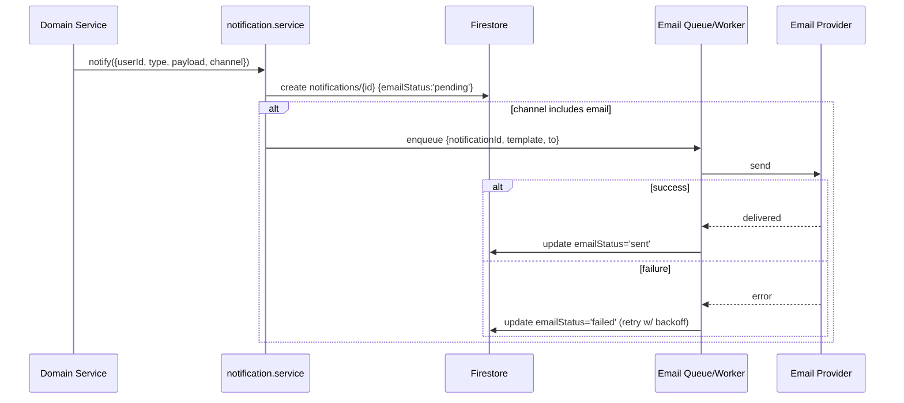
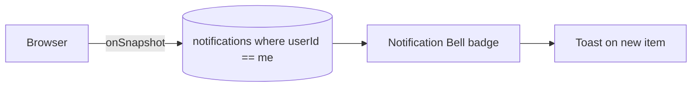

# LanTURN — Notification System

> Two channels: **in-app** (Firestore) and **email** (backend-triggered). Optional **push** later (see `MOBILE_PLAN.md`).
> See `DATABASE_SCHEMA.md §7` for the `notifications` collection and `API_SPECIFICATION.md §7` for endpoints.

---

## 1. Goals

- Notify recipients of meaningful state changes (application received, status changed, job removed, system messages).
- Provide a near-real-time in-app inbox without extra infra.
- Send transactional emails when appropriate.
- Keep the flow idempotent and decoupled from the triggering request where possible.

---

## 2. Notification Model (Firestore `notifications/{id}`)

| Field | Type | Notes |
|-------|------|-------|
| `userId` | string | Recipient uid. |
| `type` | enum | `application_received`, `application_status`, `job_removed`, `system`, `ai_ready` … |
| `title` | string | Short headline. |
| `body` | string | One or two sentences. |
| `link` | string | In-app deep link, e.g. `/employer/jobs/job_001/applicants`. |
| `data` | map | `{ jobId, applicationId, status, actorId? }`. |
| `channel` | enum | `inapp`, `email`, `both`. |
| `read` | boolean | default `false`. |
| `emailStatus` | enum | `pending`, `sent`, `failed`, `skipped`. |
| `createdAt` | timestamp | serverTimestamp. |

> Admin/system notifications reuse the same collection with `type: "system"`.

---

## 3. Event → Notification Mapping

| Domain event | Recipient | Type | Channel | Examples |
|--------------|-----------|------|---------|----------|
| Student applies to a job | Employer (owner) | `application_received` | both | "New applicant for Frontend Engineer" |
| Employer shortlists/accepts/rejects | Student | `application_status` | both | "Your application was shortlisted" |
| Job removed/closed by admin | Applicants + Employer | `job_removed` | in-app (+ email optional) | "A job you applied to was removed" |
| AI result ready (async jobs) | Student | `ai_ready` | in-app | "Your resume review is ready" |
| System announcement | All / role | `system` | in-app (+ email optional) | "Scheduled maintenance" |

---

## 4. Email Workflow



### 4.1 Implementation options (free-tier friendly)
- **Synchronous send** (simplest v1): `notification.service` writes the doc, then awaits the email provider; on failure sets `emailStatus='failed'` and does not fail the user's request.
- **Worker/queue (recommended as traffic grows):** a small in-process queue or a cron-driven sweep that picks `emailStatus='pending'` rows and sends them, with exponential backoff retries. Keeps request latency low and survives provider outages.

### 4.2 Templates
- Store templates in code (`email.service.js` + `templates/*.html`/text) keyed by `type`.
- Variables: `{{name}}`, `{{jobTitle}}`, `{{companyName}}`, `{{status}}`, `{{link}}`.
- Always include a plain-text fallback and an unsubscribe/manage-notifications link.

### 4.3 Provider
- Use a free-tier transactional provider (e.g., **Resend**, **Brevo**, **SendGrid**). Abstracted behind `email.client.js` so it's swappable.
- Set `EMAIL_FROM`, `EMAIL_API_KEY` in backend env. Verify the sending domain.

---

## 5. Real-Time Update Strategy (in-app)



- The web client opens a single `onSnapshot` query: `notifications.where('userId','==',uid).orderBy('createdAt','desc').limit(50)`.
- On new docs: increment unread badge + show a toast.
- `GET /api/notifications/unread-count` is a fallback for initial load and clients without realtime.
- Mark-read via `PATCH /api/notifications/:id/read` and `POST /api/notifications/read-all`.

### Performance notes
- Limit listener to 50 most recent to control read costs.
- Index `userId` + `createdAt` and `userId` + `read` + `createdAt` (see `FIREBASE_SETUP.md`).
- Detach the listener on logout / route leave.

---

## 6. Notification Lifecycle

```
created (read=false, emailStatus=pending|skipped)
   │
   ├── (if email) sent ──► delivered
   │                  └── failed ──► retried (backoff) ──► sent | dead-lettered
   │
   ├── user opens ──► read=true (via API)
   └── retention window ──► cleanup job (future) deletes > N days
```

**States:**
- `read`: `false` → `true` (user action only; no auto-mark on email open).
- `emailStatus`: `pending` → `sent` | `failed` | `skipped`.
- Retention: future cleanup job archives/deletes notifications older than e.g. 90 days to control Firestore size.

---

## 7. Preferences (future-ready)

- Store per-user notification preferences in `users/{uid}.notificationPrefs` (future):
  ```jsonc
  { "email": { "application_received": true, "application_status": true, "marketing": false } }
  ```
- `notification.service` consults preferences before sending email; in-app notifications always created (unless muted).

---

## 8. Reliability & Idempotency
- **Idempotency key:** when triggered by a domain event with a stable id (e.g., `applicationId + status`), check whether a notification of that type/data already exists before creating a duplicate.
- **Decoupling:** notifications are created **after** the primary transaction commits. If the email step fails, it must not roll back the domain change.
- **Observability:** log notification creation and email outcome with `userId`, `type`, `requestId`.

---

## 9. API Surface (recap)
- `GET /api/notifications` (paginated)
- `PATCH /api/notifications/:id/read`
- `POST /api/notifications/read-all`
- `GET /api/notifications/unread-count`

---

## 10. Checklist
- [ ] `notification.service` creates docs + dispatches email.
- [ ] Templates for `application_received`, `application_status`, `job_removed`, `system`.
- [ ] Real-time `onSnapshot` listener + badge + toast.
- [ ] Email provider wired with retries + status updates.
- [ ] Indexes deployed.
- [ ] Idempotency for status-change notifications.
- [ ] (Future) preferences + retention cleanup.
