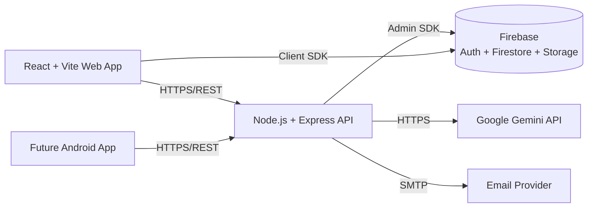

# LanTURN — Project Overview

> **Status:** Planning phase. This document describes intent and design, not implementation.
> **Audience:** Developers, AI coding agents (Claude Code, ChatGPT, Cursor), reviewers, stakeholders.

---

## 1. Vision

**LanTURN** is a placement platform that connects **students** looking for jobs and internships with **employers** looking to hire. The platform provides a smooth discovery → application → hiring flow while layering in **AI-powered career assistance** (powered by Google Gemini) to help students present themselves better and to help employers find the right candidates faster.

The name "LanTURN" reflects the goal: helping students **turn** their learning into a career launch.

---

## 2. Goals

| # | Goal | Why it matters |
|---|------|----------------|
| G1 | Provide a complete placement lifecycle (browse → apply → track → hire). | Core product value. |
| G2 | Be a **reusable, backend-first API platform**. | One backend serves web, future Android app, and desktop app. |
| G3 | Integrate AI to reduce friction for both students and employers. | Differentiator vs. plain job boards. |
| G4 | Run **100% on free-tier services** during development and early launch. | Low cost of ownership; safe to iterate. |
| G5 | Keep the codebase **modular, readable, and AI-agent-friendly**. | Fast onboarding, easy handoff to AI coding tools. |
| G6 | Strong security and role separation (Student / Employer / Admin). | Trust is essential for a hiring platform. |

### Non-Goals (for v1)

- We are **not** building the mobile app in v1 (see `MOBILE_PLAN.md`).
- We are **not** building payment/billing features.
- We are **not** doing real-time video interviews in v1.

---

## 3. Users (Roles)

There are three roles. Every authenticated user has exactly **one** primary role, assigned during profile completion.

### 3.1 Student
- Creates a rich profile (personal, academic, professional, social).
- Browses, searches, filters, and applies to jobs.
- Tracks application status.
- Chats with the AI Career Assistant.
- Receives in-app + email notifications.

### 3.2 Employer
- Creates a company profile.
- Posts, edits, and deletes jobs.
- Views applicants, accepts/rejects applications.
- Receives notifications when applications arrive.

### 3.3 Admin
- Moderates users and job postings.
- Views platform analytics.
- Manages platform-wide configuration.

---

## 4. Features (Summary)

Detailed in `REQUIREMENTS.md` and `TODO.md`. High-level groups:

| Group | Highlights |
|-------|-----------|
| **Auth** | Google Login via Firebase Auth; profile completion after first login; role assignment. |
| **Student Profile** | Personal / academic / professional / social data; resume + photo upload. |
| **Employer Profile** | Company name, logo, website, description, location, industry, HR contact. |
| **Jobs** | Post / edit / delete / browse / search / filter. |
| **Applications** | Apply, track status, accept/reject. |
| **Notifications** | In-app (Firestore) + email (backend-triggered). |
| **AI Assistant** | Resume review, resume vs. job match, skill-gap analysis, interview prep, cover letters, career guidance (Gemini). |
| **Admin** | Moderation, analytics, platform management. |

---

## 5. Architecture (Summary)

A detailed write-up lives in `SYSTEM_ARCHITECTURE.md`. In short:

Key architectural decisions:
- **Backend-first:** The Express API owns **all** business logic. The frontend never contains business logic — it only renders API data.
- **Firebase as the data layer:** Firestore (database), Firebase Auth (identity), Firebase Storage (files).
- **AI isolated behind the backend:** Gemini keys live only on the server. The frontend never calls Gemini directly.
- **Free-tier by design:** Vercel (frontend), Render or Oracle Cloud Always Free (backend), Firebase Spark/Blaze-within-free-limits.

---

## 6. Technology Stack

| Layer | Technology | Notes |
|-------|-----------|-------|
| Frontend | React + Vite + Tailwind CSS | SPA, hosted on Vercel. |
| Backend | Node.js + Express.js | REST API, hosted on Render/Oracle. |
| Database | Firebase Firestore | NoSQL, real-time-capable. |
| Auth | Firebase Authentication (Google) | OIDC; backend verifies ID tokens. |
| Storage | Firebase Storage | Resumes, profile images, logos. |
| AI | Google Gemini API | Resume review, chat, matching. |
| Frontend Hosting | Vercel | Free hobby tier. |
| Backend Hosting | Render **or** Oracle Cloud Always Free | Choose one. |
| Version Control | Git + GitHub | Conventional Commits. |
| Future Mobile | React Native + Expo **or** PWA | See `MOBILE_PLAN.md`. |

---

## 7. Documentation Map

| Document | What it covers |
|----------|---------------|
| `PROJECT_OVERVIEW.md` | This file — vision, goals, stack. |
| `REQUIREMENTS.md` | Functional / non-functional / future / constraints. |
| `SYSTEM_ARCHITECTURE.md` | Architecture, flows, Mermaid diagrams. |
| `DATABASE_SCHEMA.md` | Firestore collections, fields, indexes. |
| `API_SPECIFICATION.md` | Every endpoint, methods, bodies, responses. |
| `BACKEND_STRUCTURE.md` | Backend folder layout and file responsibilities. |
| `FRONTEND_STRUCTURE.md` | Pages, components, state, routing. |
| `MOBILE_PLAN.md` | PWA vs React Native, API reuse. |
| `FIREBASE_SETUP.md` | Firebase config, rules, indexes, env vars. |
| `GEMINI_INTEGRATION.md` | AI flows, prompts, safety, tokens. |
| `NOTIFICATION_SYSTEM.md` | Notification model, email, lifecycle. |
| `SECURITY.md` | Auth, authorization, validation, OWASP. |
| `DEVELOPMENT_ROADMAP.md` | Milestones, deliverables, checklists. |
| `CODING_GUIDELINES.md` | Naming, structure, commits, AI-agent rules. |
| `TODO.md` | Prioritized feature checklist by milestone. |

---

## 8. How to Read These Docs (for AI agents)

1. Start here, then `REQUIREMENTS.md` and `SYSTEM_ARCHITECTURE.md` for context.
2. Before writing any backend code, read `BACKEND_STRUCTURE.md` + `API_SPECIFICATION.md` + `CODING_GUIDELINES.md`.
3. Before writing any frontend code, read `FRONTEND_STRUCTURE.md` + `API_SPECIFICATION.md`.
4. Data shape questions → `DATABASE_SCHEMA.md`. Security questions → `SECURITY.md` + `FIREBASE_SETUP.md`.
5. **Never** invent endpoints or collections that are not defined in these docs. If something is missing, flag it instead of guessing.
