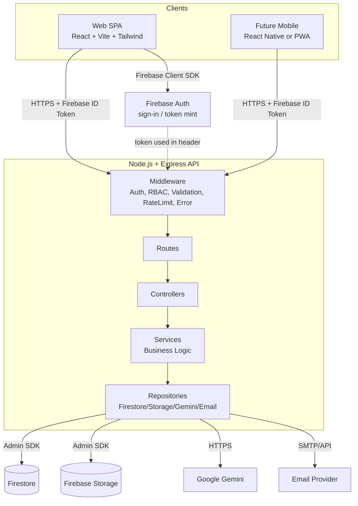
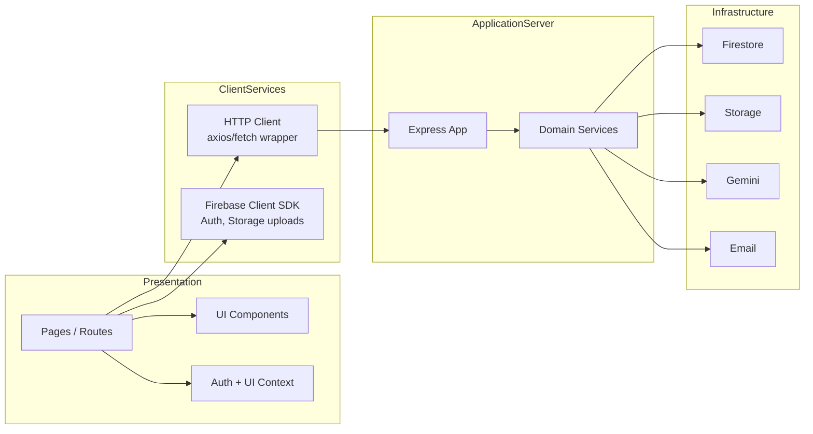
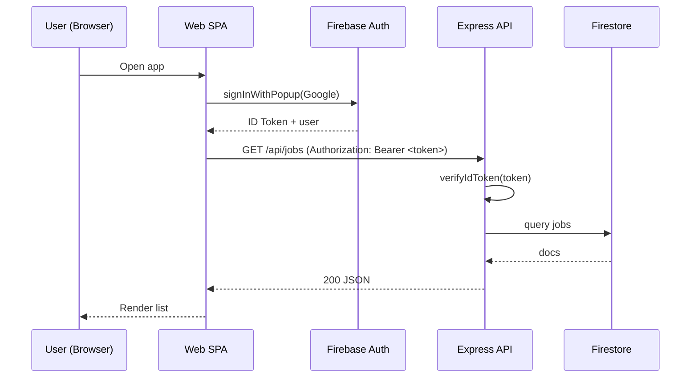
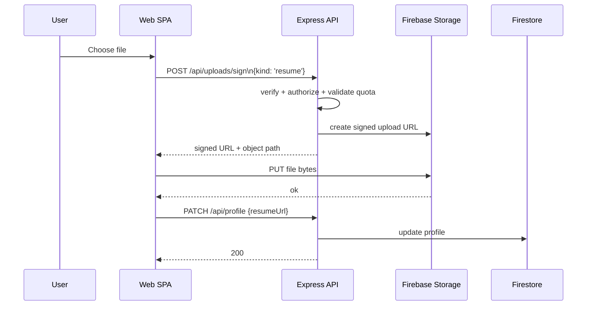
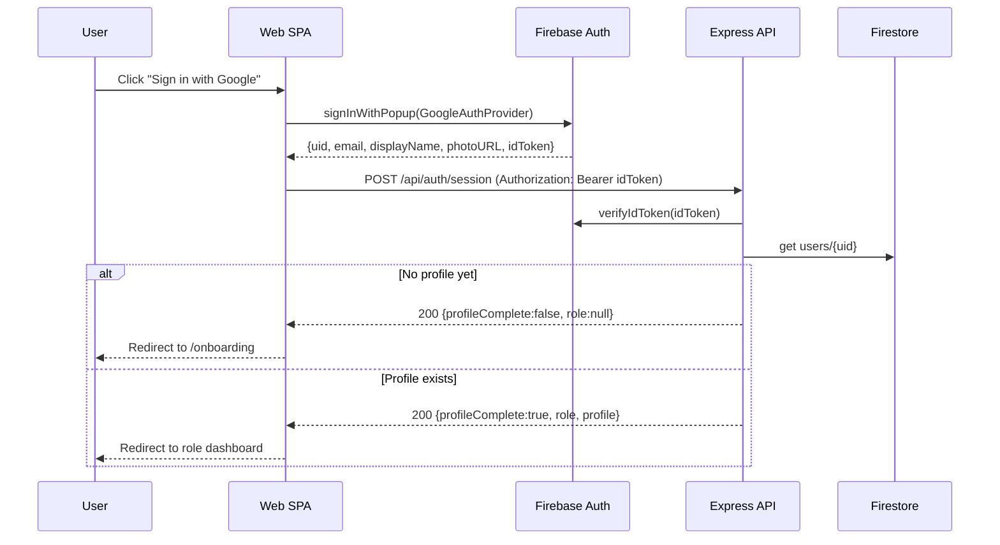
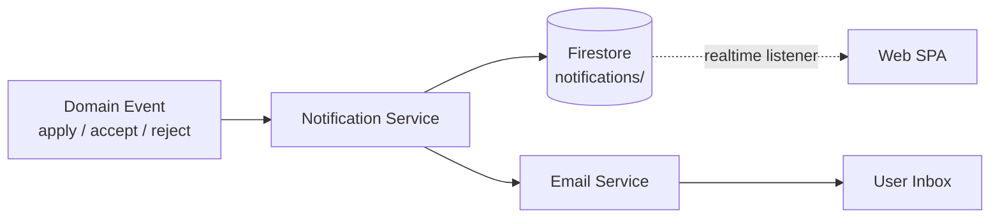
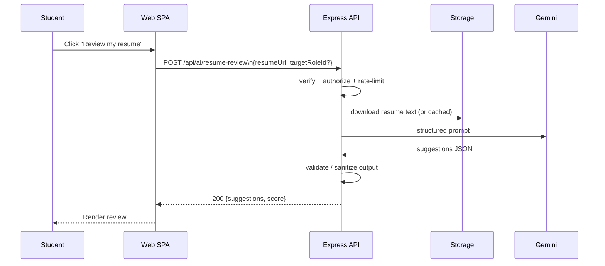
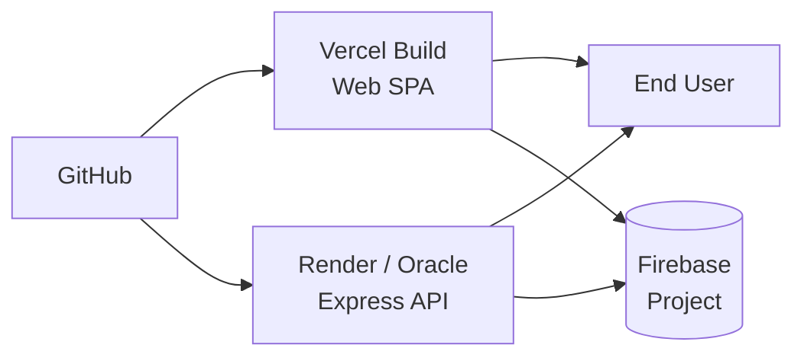

# LanTURN — System Architecture

> Companion to `PROJECT_OVERVIEW.md` and `DATABASE_SCHEMA.md`.

---

## 1. Overall Architecture

LanTURN is a **backend-first, API-driven** platform. A single Node.js/Express backend owns all business logic and is the only component allowed to talk to Firebase Admin SDK and Gemini. The web frontend is a thin React SPA that consumes REST APIs.



### Why this shape

- **Single source of truth for rules:** Putting logic in services keeps it reusable across clients.
- **Secret safety:** Firebase Admin SDK and Gemini keys live only on the server.
- **Stateless backend:** No session state in memory → horizontally scalable, easy to deploy on Render/Oracle free tier.

---

## 2. Backend-First Approach

```
1. Design data model (DATABASE_SCHEMA.md)
2. Design API contract (API_SPECIFICATION.md)
3. Build backend: routes → controllers → services → repositories
4. Verify backend with tests / Postman / curl
5. Build frontend that consumes the verified API
6. (Later) build mobile client that consumes the same API
```

**Rules:**
- The frontend MUST NOT implement business rules (e.g., eligibility, pricing, matching). It only displays and submits.
- The frontend MAY perform light UI validation (required fields, format hints), but the backend is the source of truth.

---

## 3. Logical Component Diagram



---

## 4. Data Flow

### 4.1 Typical Authenticated Read/Write



### 4.2 File Upload (Resume / Photo / Logo)

Direct-to-storage upload using a **signed URL / Firebase Storage client SDK**; the resulting download URL is then stored in Firestore via the API. The backend never proxies large files.



> Alternative: use the Firebase Client SDK to upload directly to a `pending/<uid>/` prefix, then call the API to "commit" the upload (validate, move, persist URL). Either approach is acceptable as long as Firestore stores only URLs.

---

## 5. Authentication Flow



**Key points:**
- Identity comes from Firebase Auth; **profile** lives in Firestore `users/{uid}`.
- The ID token is sent on every API call as `Authorization: Bearer <idToken>`.
- Backend middleware verifies the token and loads the user document, attaching `req.user`.

---

## 6. Notification Flow

See `NOTIFICATION_SYSTEM.md` for the full design. Summary:



Two channels: in-app (Firestore) + email (transactional). The web client subscribes to `notifications` for the current user with a Firestore `onSnapshot` listener for near-real-time updates.

---

## 7. AI Flow (Gemini)

See `GEMINI_INTEGRATION.md` for details. The frontend never calls Gemini.



- Long-running: AI endpoints have a longer timeout and graceful degradation.
- Output is validated/sanitized before being returned to the client.

---

## 8. Mobile Architecture

Detailed in `MOBILE_PLAN.md`. Recommendation: **PWA first**, native later.

- The mobile client reuses the **same REST API** — no separate backend.
- Auth uses Firebase Auth (React Native Firebase / Expo).
- Push notifications can later use Firebase Cloud Messaging (FCM).

---

## 9. Deployment Topology (Free Tier)



| Component | Host | Notes |
|-----------|------|-------|
| Web SPA | Vercel | Static build; env vars point to API + Firebase client config. |
| Express API | Render **or** Oracle Cloud Always Free | Docker or Node service; expose HTTPS. |
| Firebase | Google | Single project; separate dev/prod projects recommended. |
| Email | Resend / Brevo / SendGrid | Free tier SMTP/API. |

---

## 10. Environments

| Env | Purpose | Data |
|-----|---------|------|
| `local` | Developer machine | Emulator suite or dev Firebase project. |
| `dev` | Shared integration | Separate Firebase project; seed data. |
| `prod` | Live | Locked-down Firebase project; strict rules. |

> Use distinct Firebase projects for dev and prod. Never point dev code at prod data.

---

## 11. Cross-Cutting Concerns

| Concern | Strategy |
|---------|----------|
| **Logging** | Structured JSON logs (`pino` or `winston`); request id per request. |
| **Errors** | Central error-handling middleware; consistent error envelope. |
| **Validation** | Per-route schema validation (`zod` or `joi`). |
| **Configuration** | Validated `env` module; fail-fast on missing vars. |
| **Rate limiting** | In-memory for single instance; Redis if scaled. |
| **CORS** | Allowlist of origins from env. |
| **Secrets** | Environment variables only; never in repo. |

---

## 12. Trade-offs & Alternatives Considered

| Decision | Chosen | Alternative | Rationale |
|----------|--------|-------------|-----------|
| Architecture style | REST over HTTP | GraphQL / tRPC | REST is simplest for multi-client reuse and AI-agent comprehension. |
| Where logic lives | Backend services | Frontend | Required by project rules; enables client reuse. |
| AI calls | Server-side only | Client-side | Secret safety, quota control, prompt governance. |
| File uploads | Direct-to-storage + URL in Firestore | Proxy through API | Avoids loading large files through Node; free-tier friendly. |
| Real-time | Firestore `onSnapshot` | WebSocket server | Avoids extra infra on free tier. |
| Mobile | PWA first | React Native first | Cheapest path to mobile; reuse 100% of web. |
| DB | Firestore | Postgres | Required by stack; fits real-time notifications and free tier. |
